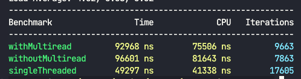
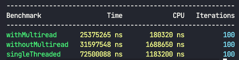

This project counts the number of words in a file using multiple threads.

## How to Run

1. Change the full path of the file in `count.h`.
2. Compile and run `main.cpp`.

## Benchmark

1. Set up [Google Benchmark](https://github.com/google/benchmark).
2. Compile, modify if needed, and run `benchmark.cpp` using the following command:

```bash
g++ Benchmark.cpp -std=c++17 -isystem benchmark/include \
  -Lbenchmark/build/src -lbenchmark -lpthread -o Benchmark
```
## Results

In the context of the results:
- *Multiread* means that each thread reads its part by itself.
- Without *multiread*, it simply counts words in its part.

Here are two sample benchmarks on my machine:

With a small input:



With a larger input:


